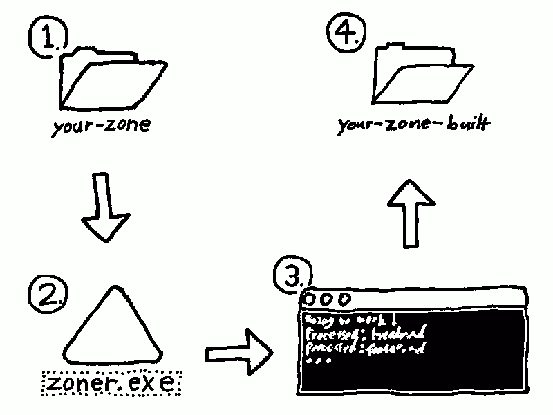

# Welcome to Zoner!

**Zoner** is a drag and drop static site generator for making [Zonelets](https://zonelets.net/)-style blogs!

## Why?

I wanted to start writing my own blog, but I couldn't figure out how to use other static site generators like [Jekyll](https://jekyllrb.com/). I found [Zonelets](https://zonelets.net/) and it seemed like the perfect choice, but after making websites for years I didn't want to mess with html or javascript files in my off-time. So I made this little console application to generate Zonelet blogs from [Markdown](https://en.wikipedia.org/wiki/Markdown) files.

This allows you to keep your source separate from your built site, in case you want source control for versioning of your writing. It also allows for a true static website, so older browsers without javascript and people with slow internet can still read it at blazing fast speeds.

But mainly this tool exists for: making your Zonelet more maintainable, writing blog posts quicker and easier, and keeping the site style consistent across pages.

## How?

## Features?

- A super simple workflow for making beautiful blogs.
- HTML optimized for screen readers.
- Automatic [RSS](https://en.wikipedia.org/wiki/RSS) feed generation.
- Disqus comment support.
- Backwards compatability with existing Zonelets.
- Open source, [MIT](https://en.wikipedia.org/wiki/MIT_License), easy to extend or chain into existing workflows.

## Where can I get it?

You can download it from [itch.io](https://ryantrawick.itch.io/zoner)!

## Recent Posts:

<!-- An <archive> tag with a count attribute will show that count of the most recent posts! For a "more posts" button add a more attribute with your archive link. -->

<archive count="4" more="./archive"></archive>

<!-- The "more posts" button will not appear if there are fewer or equal posts to the count attribute. -->

<small>Zoner is not affiliated with the official Zonelets. Consider it software fan art.</small>